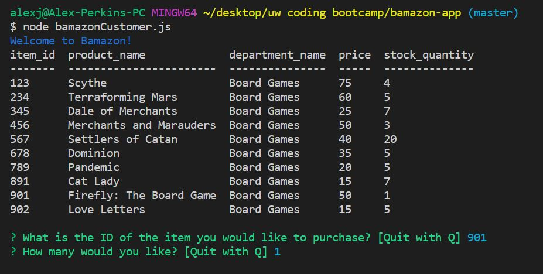
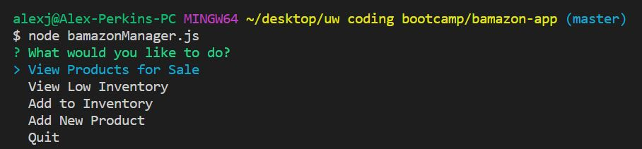
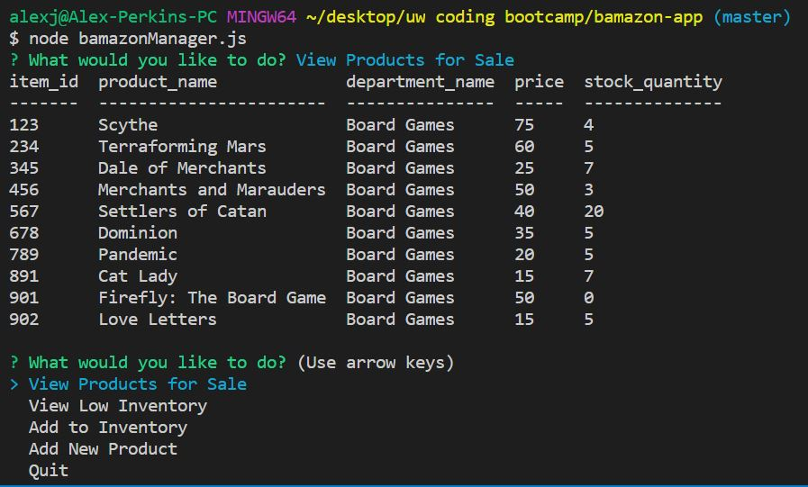

# Bamazon App
This is a CLI-based tool that emulates an online store application. The purpose of building this application is to become familiar with create Node CLI-based tools and integrating Node.js with MySQL.

# Technologies/NPM Packages Used
- Node.js
- MySQL
- Dotenv
- Colors
- Console.table

# Directions
There are two primary components to the application. The first component is a customer interface whereby customers can browse available merchandise, see the quantity available, price per item, and make purchases.

The second component is a Store Manager interface, whereby the amount of merchandise can be seen, low-inventory products restocked, and new products added.

# Demonstrations
## Customer Interface Demonstration
The first and most simple phase of the application is the Customer's interface. Here, the customer merely has to select and idem by ID and input the quantity of the item they wish to purchase.

## Manager Interface Demonstration

The second and more robust phase of the application is the Manager's interface. Here, the manager is presented initially with a menu of options:

The Manager can choose to view the products (derived from the same database as the Customer's view):

The Manager can choose to view products with low inventory (5 or less items):

The Manager can choose to add to the inventory of existing items:

The Manager can choose to even add new products to the department:

Finally, once the Manager's job is done, they can select "Quit" to exit the Manager's console view:

